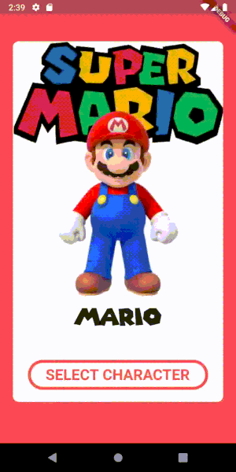

# parallax_swiper

A swiper widget with parallax effect with support for both swipe directions.

## Installation
Add `parallax_swiper: ^0.0.1` to your `pubspec.yaml` file.
Import it by adding to your file:
```dart
import 'package: parallax_swiper/parallax_swiper.dart'
```
## Use
Create a `ParallaxSwiper` widget and pass the required parameters.

```dart
ParallaxSwiper(
    backgroundWidget: bgWidget,
    foregroundWidgets: <Widget>[fgWidget1, fgWidget2, fgWidget3],
)
```

## Parameters

```dart
ParallaxSwiper(
    backgroundWidget: bgWidget,
    foregroundWidgets: <Widget>[fgWidget1, fgWidget2, fgWidget3],
    alignment: Alignment.center,
    returnDuration: Duration(milliseconds: 1000),
    returnCurve: Curves.easeOut,
    backgroundRotationFactor: 0.001,
    foregroundRotationFactor: 0.001,
    foregroundTranslationFactor: 0.2,
    swiperHeight: 300,
    swiperInitialPage: 0,
    swiperInfiniteSwipe = false,
    swipeDirection: Axis.vertical,
    swiperDuration: Duration(milliseconds: 500),
    swiperCurve: Curves.easeOut,
    onItemChanged: onItemChangeCallback,
    onTap: onTapCallback,
    onDoubleTap: onDoubleTapCallback,
    onLongPress: onLongPressCallback,
)
```

`backgroundWidget` - `Widget`
The widget to be displayed in the background.

`foregroundWidgets` - `List<Widget>`
A list of widgets to be displayed in the foreground and be swiped.

`alignment` - `Alignment`
The alignment in the widget stack, default `Alignment.center`.

`returnDuration` - `Duration`
The amount of time for the widget to return to the center position after a drag ends.

`returnCurve` - `Curve`
The curve for the return animation after a drag ends.

`backgroundRotationFactor` - `double`

`foregroundRotationFactor` - `double`

`foregroundTranslationFactor` - `double`

`swiperHeight` - `double`
The height of the foreground swiper.

`swiperInitialPage` - `int`
The initial page/item to be shown by the swiper.

`swiperInfiniteSwipe` - `bool`
Set the swipe to be infinite or limited to the amount of items in the foregroundWidgets list.

`swipeDirection` - `Axis`
The direction of the swipe.

`swiperDuration` - `Duration`
The duration of the animation of the swipe.

`swiperCurve` - `Curve`
The curve of the animation of the swipe

`onItemChanged` - `Function`
Callback function for when an item changed in the swiper.

`onTap` - `Function`
Callback function after a tap on the widget.

`onDoubleTap` - `Function`
Callback function after a double tap on the widget.

`onLongPress` - `Function`
Callback function after a long press on the widget.


## Example
Horizontal swipe


Vertical swipe


### Credits
Example images source: [Super Mario Wiki](https://www.mariowiki.com/)
Example font: [Super Mario 256 by fsuarez913](https://www.dafont.com/super-mario-256.font)

